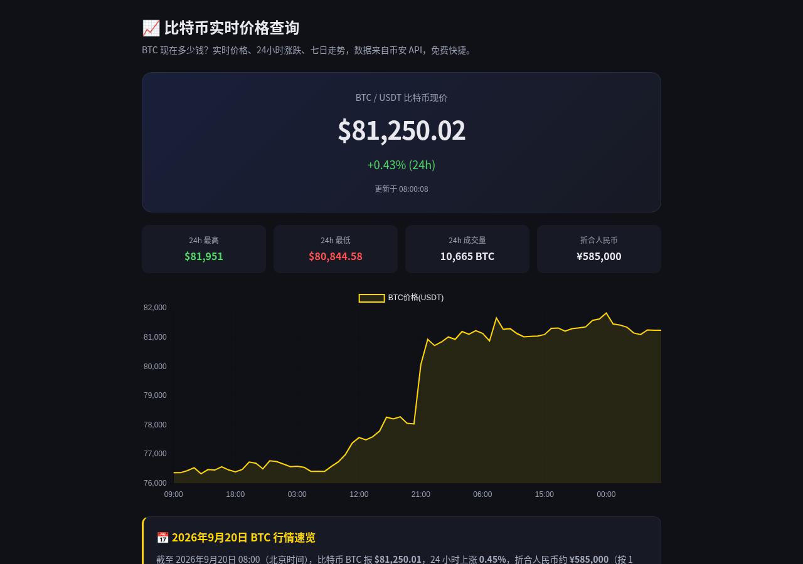
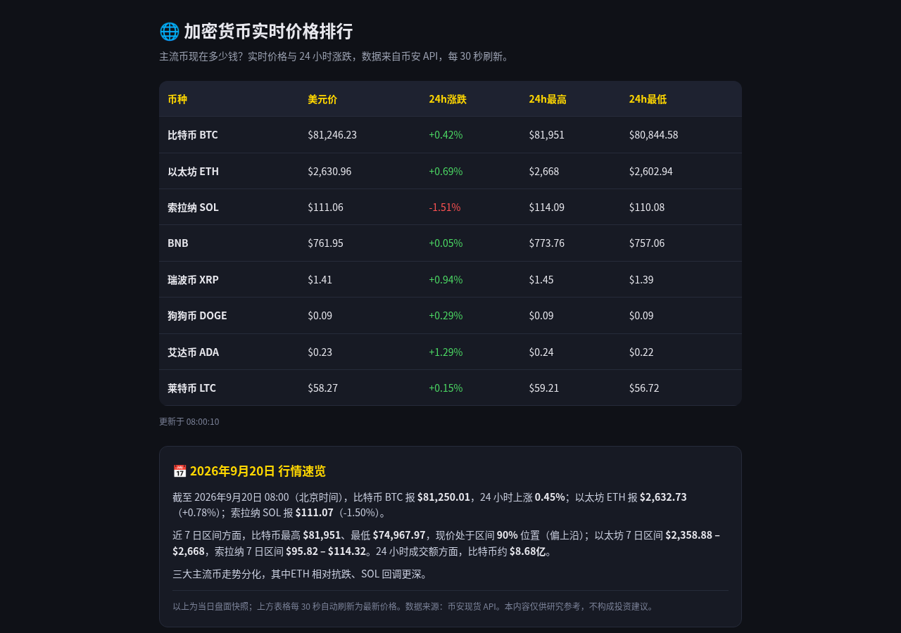
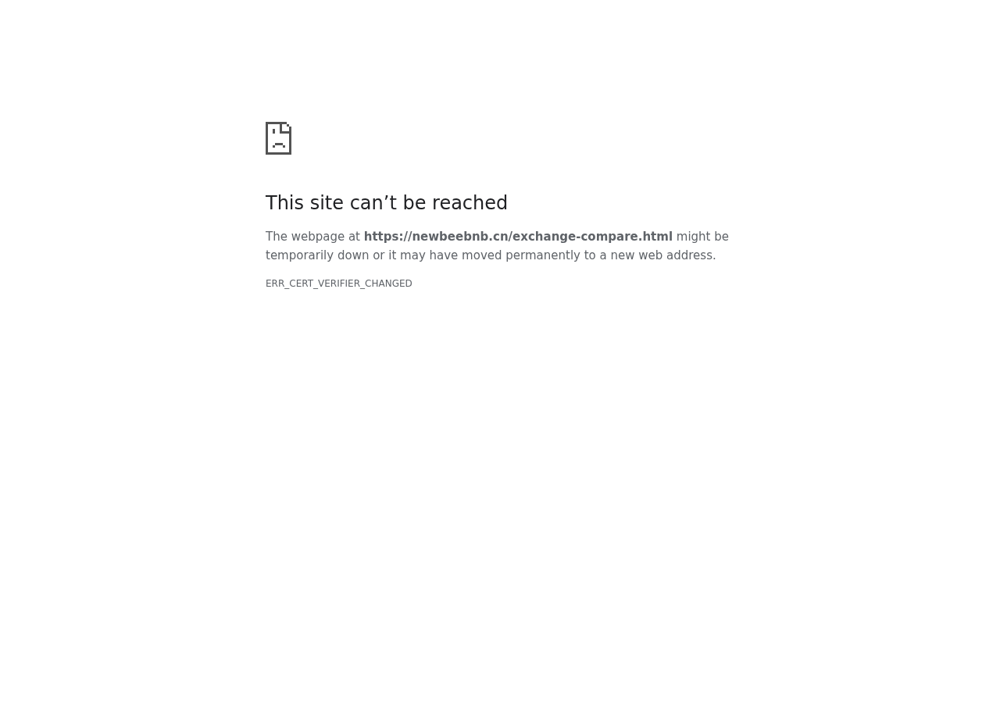

# 🐝 NEWBEE

**币安/欧易/Bybit/Bitget 交易所下载注册指南 · BTC 比特币新手教程 · 加密货币工具导航**

[🌐 newbeebnb.cn](https://newbeebnb.cn/) · 加密货币新手的一站式入口

---

## 📌 这是什么

NEWBEE 是一个面向**加密货币新手**的中文导航与学习站，解决新手最常见的问题：

> 交易所哪个靠谱？怎么注册下载？USDT 怎么买怎么卖？币圈黑话听不懂？合约杠杆是什么？

我们把这些散落在各处的信息，整理成**新手能直接看懂的中文教程 + 实用工具**。

## ✨ 核心内容

### 🧮 免费工具（16+，即开即用）

**👀 先睹为快 —— 工具实拍：**

  
  
  

  
  
  

| 工具 | 用途 |
|---|---|
| [BTC 价格](https://newbeebnb.cn/btc-price.html) | 比特币实时行情 |
| [ETH 价格](https://newbeebnb.cn/eth-price.html) | 以太坊实时行情 |
| [加密货币行情](https://newbeebnb.cn/crypto-market.html) | 主流币种市场总览 |
| [币种转换器](https://newbeebnb.cn/crypto-converter.html) | 币种间汇率换算 |
| [DCA 定投计算器](https://newbeebnb.cn/btc-dca-calculator.html) | 定投收益模拟 |
| [复利计算器](https://newbeebnb.cn/dca-compound-calculator.html) | 复利增长测算 |
| [合约计算器](https://newbeebnb.cn/contract-calculator.html) | 合约盈亏计算 |
| [合约张数/保证金计算](https://newbeebnb.cn/fee-calculator.html) | 仓位计算 |
| [止盈止损计算器](https://newbeebnb.cn/stop-loss-take-profit-calculator.html) | 交易风控 |
| [网格收益模拟器](https://newbeebnb.cn/grid-profit-simulator.html) | 网格策略收益预估 |
| [交易所对比](https://newbeebnb.cn/exchange-compare.html) | 主流交易所横向对比 |

还有加密货币黑话词典、大佬图鉴、历史大事记等趣味内容。

### 🆕 最新文章

- [移动端交易实战：手机下单入门全流程（2026）](https://newbeebnb.cn/posts/mobile-trading-guide-2026) · 2026-09-20
- [常用交易指标入门：均线、MACD、RSI 一次讲清（2026）](https://newbeebnb.cn/posts/trading-indicators-beginners-2026) · 2026-09-19
- [加密货币交易心理：如何克服追涨杀跌？（2026）](https://newbeebnb.cn/posts/crypto-trading-psychology-2026) · 2026-09-18
- [现货交易 vs 合约交易：新手到底该选哪个？（2026）](https://newbeebnb.cn/posts/spot-vs-futures-trading-guide-2026) · 2026-09-17
- [币安注册：大陆用户从开页到KYC的完整流程](https://newbeebnb.cn/posts/binance-registration-mainland-china-guide) · 2026-09-16
- [K线图详解：新手也能看懂的蜡烛图与常用指标（2026版）](https://newbeebnb.cn/posts/candlestick-chart-technical-analysis-2026) · 2026-09-16
- [存储芯片超级周期：美光、SK海力士暴涨暴跌背后的多空逻辑（2026）](https://newbeebnb.cn/posts/memory-chip-supercycle-bull-bear-2026) · 2026-09-15
- [Bybit卡申请指南：虚拟卡开卡、充值与绑定](https://newbeebnb.cn/posts/bybit-card-application-guide) · 2026-09-15

### 📚 新手教程（持续更新）

交易所注册下载、出入金、USDT 买卖、虚拟卡订阅、防骗指南等实操长文，每天更新。

### ✍️ 专栏文章（站外分发）

- [分享几个我在用的比特币定投/回测工具（全部免费，无广告）](https://zhuanlan.zhihu.com/p/2080058359873529276) — 知乎 · 2026-09-06

### 🔗 交易所导航

币安 Binance、欧易 OKX、Bybit、Bitget 等主流交易所的**官方注册入口与下载指引**。

## 🛡️ 站点健康与工程

- ✅ **安全响应头 5 项全覆盖** (HSTS / CSP / X-Frame-Options / nosniff / Referrer-Policy)
- ✅ **Schema.org 结构化数据 100/100** (Organization + WebPage + WebSite + Article)
- ✅ **性能** PageSpeed 91/100 · LCP 0.4s · CLS 0 (2026-09-07 实测)
- 📋 完整体检修复记录: [docs/engineering-2026-09.md](docs/engineering-2026-09.md)

## 🎯 设计理念

- **新手视角**：不堆术语，讲人话，一步步来
- **免费**：所有工具和教程完全免费，无隐藏收费
- **安全**：只收录主流合规交易所，不碰野鸡平台
- **持续更新**：内容工厂每日产出新教程

## 🗺️ 站点地图

- 首页：https://newbeebnb.cn/
- 工具导航：https://newbeebnb.cn/tools.html
- 全部文章：https://newbeebnb.cn/posts
- Sitemap：https://newbeebnb.cn/sitemap.xml

## 📬 联系

欢迎通过站点反馈建议，或 GitHub Issue 交流。

---

NEWBEE · 让加密货币入门不再难 🐝

